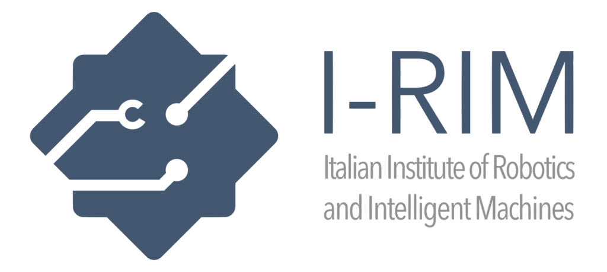

# IRIM 2025 Navigation Challenge simulation framework

- Version 1.0.0

---

<div style="display:flex;">
<div style="flex:50%; padding-right:10px; border-right: 1px solid #dcdde1">

**Package summary**

A repository for IRIM-2025 Navigation Challenge. Used for build, test, and deployment for the challenge.

- Maintainer status: maintained
- Maintainers
  - Andrea Pupa
  - Clemente Lauretti

</div>
<div style="flex:40%; padding-left:10px;">

**Table of Contents**
- [Overview](#overview)
- [Installation Steps](#installation-steps)
- [Usage](#usage)
- [Issues](#issues)

</div>
</div>

---

## Overview

  

- This repository provides a framework and the URDF for the simulation of the challenge 
- You can find information about the challenge on the <a href="https://i-rim.it/en/challenges-4/">rule page</a>.
- The supported robot for this simulation is the TIAGo Base, which was developed by PAL Robotics.

---

## Installation Steps

It is assumed that you already have a computer with ROS installed and the required packages for the TIAGo Base.

If not, follow the tutorial on the official ROS website (Noetic)  <a href="http://wiki.ros.org/noetic/Installation">here</a>. Subsequently, install the tutorials package <a href="https://wiki.ros.org/Robots/PMB-2/Tutorials/Installation/InstallUbuntuAndROS">here</a>.

Ypu need also to download and install this <a href="https://github.com/marziapi/pedsim_ros_with_gazebo">repository</a>.


After this, everything should autoinstall with the command:
```
rosdep install --from-paths src --ignore-src -r -y
```

## Usage
You can run the demo using the launch file:

```
roslaunch navigation_challenge tiago_base.launch
```

Wait a certain amount of time and when everything is ready you can move the base by publishing on the topic:
```
rostopic pub -r 50 /mobile_base_controller/cmd_vel geometry_msgs/Twist "linear:
  x: 0.1
  y: 0.0
  z: 0.0
angular:
  x: 0.0
  y: 0.0
  z: 0.1"
```

### Sensor topics:

The robot is endowed with a laser scanner.
To see the data, check the topics

```
/scan_raw
```

### Note:
There is also a launch file for the full Tiago. This requires to install the Tiago package available <a href="http://wiki.ros.org/Robots/TIAGo/Tutorials/Installation/InstallUbuntuAndROS">here</a>.
  
## Issues:

If you encounter any issues, please contact us at our email address:
* andrea.pupa@unimore.it
* c.lauretti@unicampus.it
